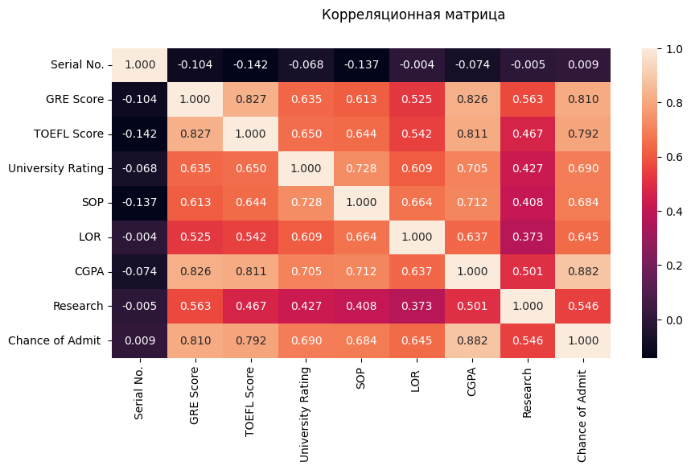
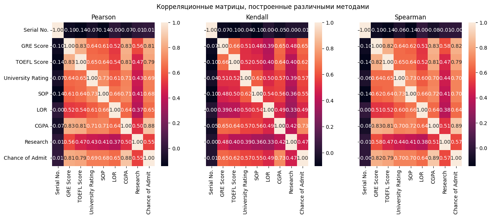
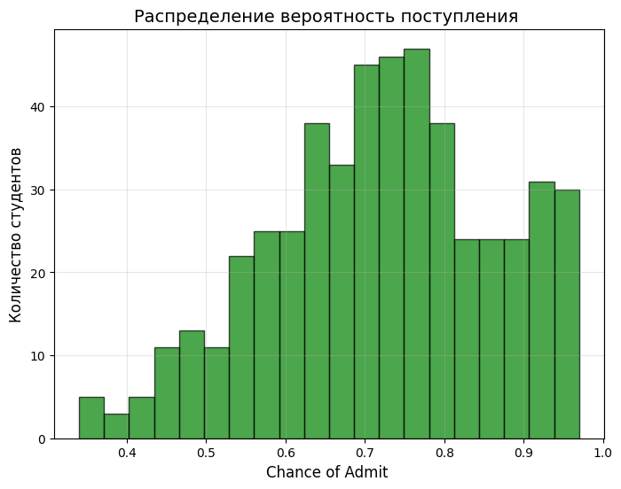

# Корреляционный анализ

## 1. Пропуски

| Колонка | Количество пропусков |
|---------|---------------------|
| Serial No. | 0 |
| GRE Score | 0 |
| TOEFL Score | 0 |
| University Rating | 0 |
| SOP | 0 |
| LOR | 0 |
| CGPA | 0 |
| Research | 0 |
| Chance of Admit | 0 |

**Вывод:** Пропуски отсутствуют. Удаление строк или колонок не требуется.

## 2. Корреляция 

# Корреляционная матрица

## Полная матрица корреляций 

| Признак | Serial No. | GRE Score | TOEFL Score | University Rating | SOP | LOR | CGPA | Research | Chance of Admit |
|---------|------------|-----------|-------------|-------------------|-----|-----|------|----------|-----------------|
| **Serial No.** | 1.000 | -0.104 | -0.142 | -0.068 | -0.137 | -0.004 | -0.074 | -0.005 | 0.009 |
| **GRE Score** | -0.104 | 1.000 | 0.827 | 0.635 | 0.613 | 0.525 | 0.826 | 0.563 | **0.810** |
| **TOEFL Score** | -0.142 | 0.827 | 1.000 | 0.650 | 0.644 | 0.542 | 0.811 | 0.467 | **0.792** |
| **University Rating** | -0.068 | 0.635 | 0.650 | 1.000 | 0.728 | 0.609 | 0.705 | 0.427 | **0.690** |
| **SOP** | -0.137 | 0.613 | 0.644 | 0.728 | 1.000 | 0.664 | 0.712 | 0.408 | **0.684** |
| **LOR** | -0.004 | 0.525 | 0.542 | 0.609 | 0.664 | 1.000 | 0.637 | 0.373 | **0.645** |
| **CGPA** | -0.074 | 0.826 | 0.811 | 0.705 | 0.712 | 0.637 | 1.000 | 0.501 | **0.882** |
| **Research** | -0.005 | 0.563 | 0.467 | 0.427 | 0.408 | 0.373 | 0.501 | 1.000 | **0.546** |
| **Chance of Admit** | 0.009 | 0.810 | 0.792 | 0.690 | 0.684 | 0.645 | 0.882 | 0.546 | 1.000 |

## Корреляция с целевой переменной (Chance of Admit)

| № | Признак | Корреляция |
|---|---------|------------|
| 1 | CGPA | **0.882** |
| 2 | GRE Score | **0.810** |
| 3 | TOEFL Score | **0.792** |
| 4 | University Rating | **0.690** |
| 5 | SOP | **0.684** |
| 6 | LOR | **0.645** |
| 7 | Research | **0.546** |
| 8 | Serial No. | 0.009 |

## 3. Можно ли строить ML модели?

### 1. Нет пропусков
- Все колонки полностью заполнены (0 пропусков)
- Не нужно удалять строки или восстанавливать значения

### 2. Все признаки числовые
- В датасете нет текста или категорий, которые нужно кодировать

### 3. Есть сильные корреляции
- CGPA коррелирует с ответом на 0.88
- GRE Score коррелирует на 0.81
- Значит модель сможет научиться предсказывать

### 4. Достаточно данных

### 5. Целевая переменная — число
- Chance of Admit от 0 до 1

**Данные готовы.** Можно сразу строить модели без дополнительной обработки.

## 4. Вклад признаков (от важного к неважному)
1. CGPA
2. GRE Score  
3. TOEFL Score
4. University Rating
5. LOR
6. SOP
7. Research
8. Serial No.
